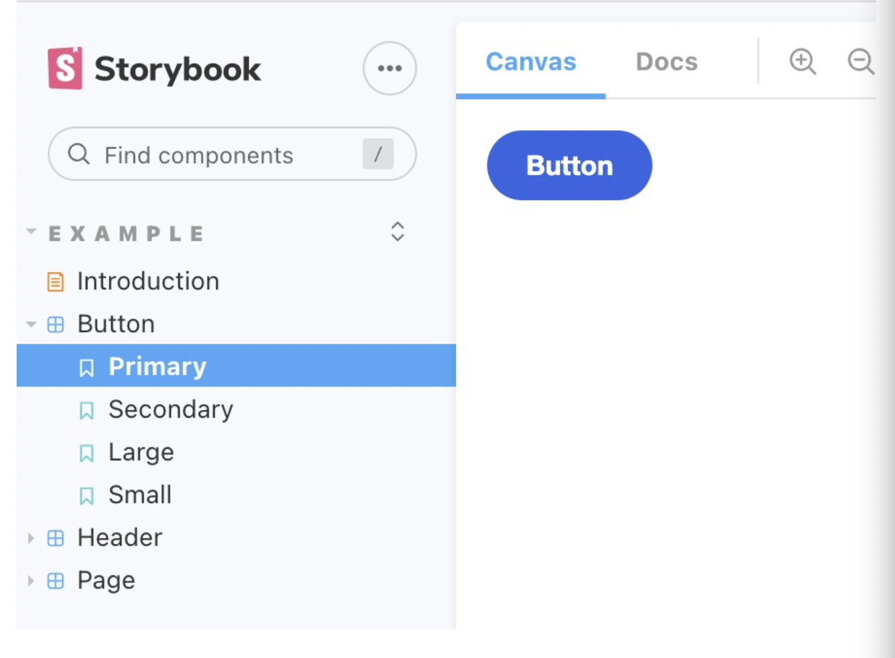

This is a [Next.js](https://nextjs.org/) project bootstrapped with [`create-next-app`](https://github.com/vercel/next.js/tree/canary/packages/create-next-app).

## Getting Started

First, run the development server:

```bash
npm run dev
# or
yarn dev
```

Open [http://localhost:3000](http://localhost:3000) with your browser to see the result.

You can start editing the page by modifying `pages/index.tsx`. The page auto-updates as you edit the file.

[API routes](https://nextjs.org/docs/api-routes/introduction) can be accessed on [http://localhost:3000/api/hello](http://localhost:3000/api/hello). This endpoint can be edited in `pages/api/hello.ts`.

The `pages/api` directory is mapped to `/api/*`. Files in this directory are treated as [API routes](https://nextjs.org/docs/api-routes/introduction) instead of React pages.

## Learn More

To learn more about Next.js, take a look at the following resources:

- [Next.js Documentation](https://nextjs.org/docs) - learn about Next.js features and API.
- [Learn Next.js](https://nextjs.org/learn) - an interactive Next.js tutorial.

You can check out [the Next.js GitHub repository](https://github.com/vercel/next.js/) - your feedback and contributions are welcome!

## Deploy on Vercel

The easiest way to deploy your Next.js app is to use the [Vercel Platform](https://vercel.com/new?utm_medium=default-template&filter=next.js&utm_source=create-next-app&utm_campaign=create-next-app-readme) from the creators of Next.js.

Check out our [Next.js deployment documentation](https://nextjs.org/docs/deployment) for more details.

# Next.js 環境構築
1. Next.js インストール
2. Tailwindの設定
3. Sassの設定
4. Storybookの設定
5. Prettierの設定
6. Jestの設定
7. Importのエイリアスの設定

参考サイト
https://zenn.dev/otanu/articles/f0a0b2bd0d9c44

- Next.js インストール
```bash
# プロジェクトをインストール
npx create-next-app --ts nextjs-ts-storybook-tailwind

# package-lock.jsonを削除
rm package-lock.json
# yarn.lockファイルを作成
yarn install
# 起動する
yarn dev
```

- Tailwindの設定
```bash
# これ何
yarn add -D tailwindcss@latest postcss@latest autoprefixer@latest
# postcss.config.jsファイルとtailwind.config.jsファイルを作成
npx tailwindcss init -p
```

> Next.jsのグローバルのCSSの設定に、Tailwindの設定を入れます。  
> 元にあった値は使わないので、まるごと入れ替え。  
> `styles/globals.css`の内容を編集する。  
```css
@tailwind base;
@tailwind components;
@tailwind utilities;
```
画像の部分はESLintのエラーが出るので気になる場合は`pages/index.tsx`を編集
(エラーになってなかったんだが？)

```tsx
// 画像の部分はESLintのエラーが出るので、気になる場合は以下のように差し替え。
<Image src="/vercel.svg" alt="Vercel Logo" width={72} height={16} />
```

Home.modules.cssは不要になるので削除します。

- Sassの設定
> SCSSを使うため、Next.jsのドキュメントに沿ってSASSを入れて行きます。   
```bash
yarn add sass
```

> next.config.jsの内容を下記のように編集  
(したほうがいいのかわからん)
```js
/** @type {import('next').NextConfig} */

const path = require("path");

module.exports = {
  reactStrictMode: true,
  sassOptions: {
    includePaths: [path.join(__dirname, "styles")],
  },
};
```

# Storybookの設定
> 初期設定やサンプルのインストールは以下のコマンドで出来ます。  
```bash
npx sb init
```

```bash
# StorybookをWebpack5 で起動出来るようにする
yarn add -D webpack @storybook/builder-webpack5 @storybook/manager-webpack5
# PostCSS/SASSのloaderを追加する
yarn add -D style-loader css-loader postcss-loader sass-loader
```

> .storybook/main.jsの内容を編集する  
(したほうがいいのかわからん)
```js
module.exports = {
  stories: [
    "../stories/**/*.stories.mdx",
    "../stories/**/*.stories.@(js|jsx|ts|tsx)",
  ],
  addons: ["@storybook/addon-links", "@storybook/addon-essentials"],
  core: {
    builder: "webpack5",
  },
  webpackFinal: (config) => {
    config.module.rules.push({
      test: /\.scss$/,
      sideEffects: true,
      use: [
        "style-loader",
        {
          loader: "css-loader",
          options: {
            importLoaders: 2,
          },
        },
        {
          loader: "postcss-loader",
          options: {
            postcssOptions: {
              plugins: [require("tailwindcss"), require("autoprefixer")],
            },
          },
        },
        {
          loader: "sass-loader",
          options: {
            sourceMap: true,
          },
        },
      ],
    });

    return config;
  },
};
```
> .storybook/preview.jsの内容を編集  
(したほうがいいのかわからん)
```js
import "../styles/globals.scss"

export const parameters = {
  actions: { argTypesRegex: "^on[A-Z].*" },
  controls: {
    matchers: {
      color: /(background|color)$/i,
      date: /Date$/,
    },
  },
}
```

なんかsass関連でエラーが出てたので答えうつしました。意味不
サンプルhttps://github.com/otanu/nextjs-boilerplate
```bash
# 設定に問題がなければ表示される
yarn storybook
```


# Prettierの設定
```bash
yarn add -D prettier eslint-config-prettier
# .prettierrc.jsonファイルを作成
echo {}> .prettierrc.json
# .prettierignoreファイルを作成
touch .prettierignore
```

> .prettierignoreに追記  
```txt
.next
node_modules
```

> .prettierrc.jsonに追記  
```json
// 内容はお好みで。
{
  "endOfLine": "lf",
  "semi": false,
  "trailingComma": "all",
  "singleQuote": true,
  "printWidth": 100,
  "tabWidth": 2
}
```

> .eslintrc.jsonの内容を変更  
```json
{
  "extends": ["next/core-web-vitals", "prettier"]
}
```

> yarn prettier --check . で対象のファイルを確認できる  
(なんかエラー出たけど)

> yarn prettier で実行できるように、package.json のscriptsに以下の設定を追加します。  
```json
"prettier": "prettier --write .",
```

